# Kostox Omarchy teema

Personal Omarchy theme snapshot based on the current desktop setup. This copy preserves the active theme files, wallpapers, Walker menu styling, Waybar styling, terminal colors, GTK/app styling, and related Omarchy theme assets so it can be restored later or copied to another Omarchy machine.

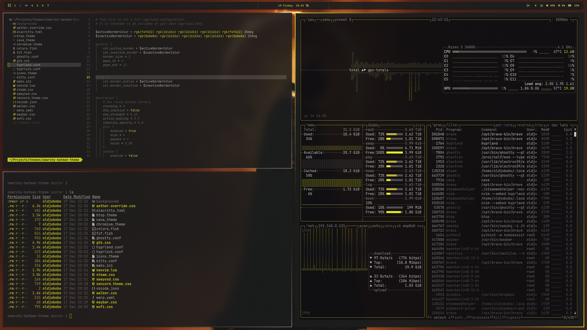
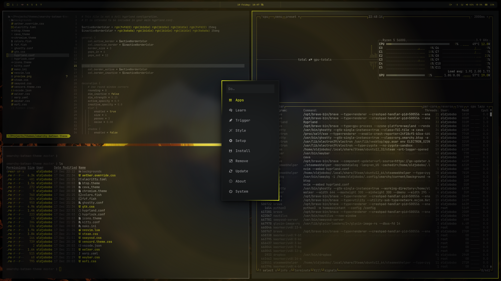

## What's included
- Hyprland: custom border colors, 3px borders, and opacity rules (`hyprland.conf`)
- Hyprlock palette variables (`hyprlock.conf`)
- Waybar colors (`waybar.css`), based on https://github.com/HANCORE-linux/waybar-themes?tab=readme-ov-file by HANCORE-Linux
- Terminals: Alacritty (`alacritty.toml`), Ghostty (`ghostty.conf`), Kitty (`kitty.conf`), Warp (`warp.yaml`)
- Shell/UI tools: Starship Bash prompt (`starship.toml`), btop (`btop.theme`), Cava (`cava_theme`), fzf (`fzf.fish`), fish colors (`colors.fish`)
- Notifications and helpers: Mako (`mako.ini`), SwayOSD (`swayosd.css`), Walker launcher (`walker.css`), Wofi (`wofi.css`)
- Neovim Aether colorscheme + LazyVim config (`neovim.lua`), VS Code (`vscode.json`)
- GTK + Aether overrides (`gtk.css`, `aether.override.css`)
- Browser + apps: Chromium (`chromium.theme`), Steam (`steam.css`), Vencord (`vencord.theme.css`)
- Icon theme pointer (`icons.theme`)

## Quick start
Install and apply the Omarchy theme:

```bash
omarchy theme install https://github.com/Hollowiman/kostoxomarchy.git
```

To also install the matching Waybar layout and Bash prompt:

```bash
~/.config/omarchy/themes/kostoxomarchy/install-extras.sh
```

## Waybar install
Back up your existing Waybar config, then copy the theme files from this repo:

```bash
mkdir -p ~/.config/waybar.backup
cp -a ~/.config/waybar/* ~/.config/waybar.backup/
cp -a waybar-theme/* ~/.config/waybar/
omarchy-restart-waybar
```

Or use the included installer, which also copies `waybar-theme/scripts/` and backs up your existing Waybar config:

```bash
~/.config/omarchy/themes/kostoxomarchy/install-extras.sh
```

## Bash prompt install
Omarchy does not apply `starship.toml` automatically when a theme is installed. To use the matching Bash prompt, copy it after installing the theme:

```bash
cp -a ~/.config/omarchy/themes/kostoxomarchy/starship.toml ~/.config/starship.toml
```

Wallpapers live in `backgrounds/`; `preview.png` and `preview2.png` show the intended look.

## Background previews

| | | |
| --- | --- | --- |
| 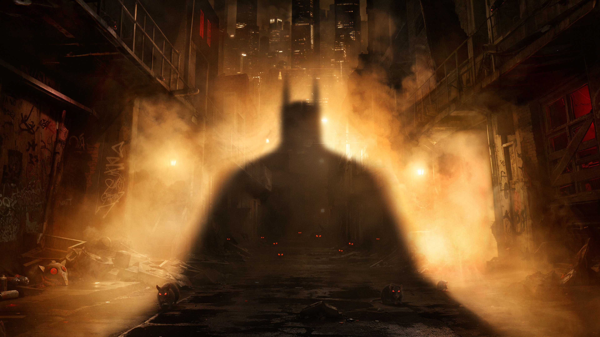 | 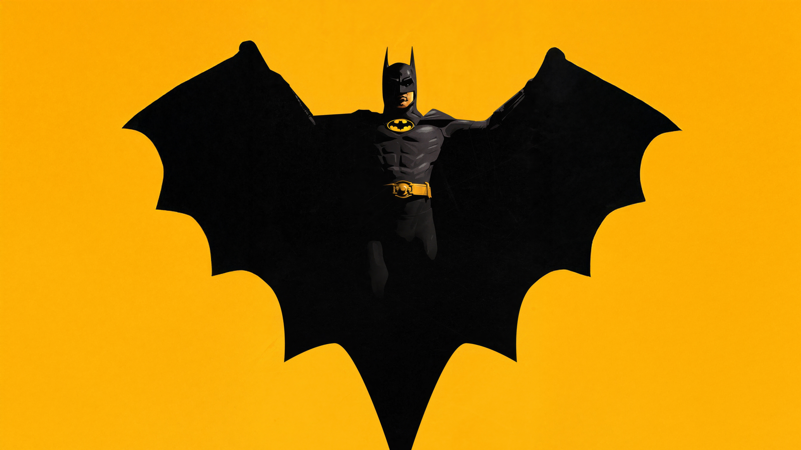 | 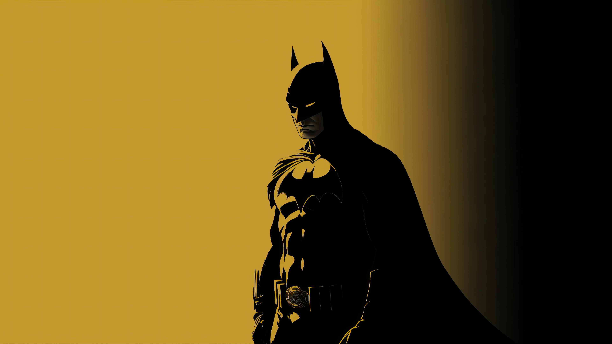 |
| 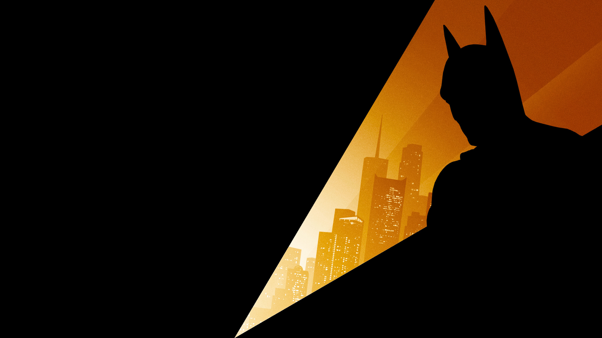 | 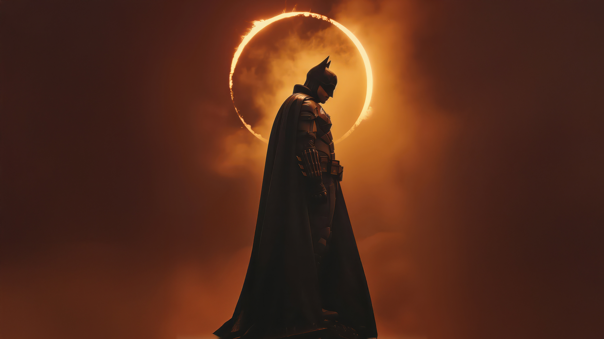 | 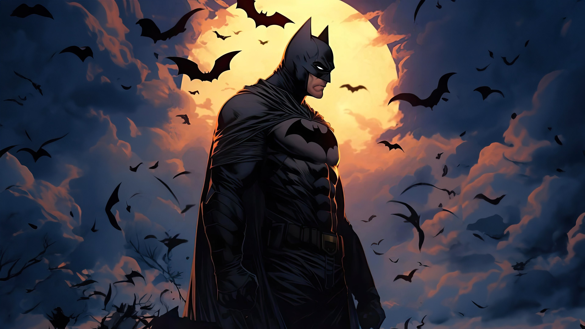 |
|  | 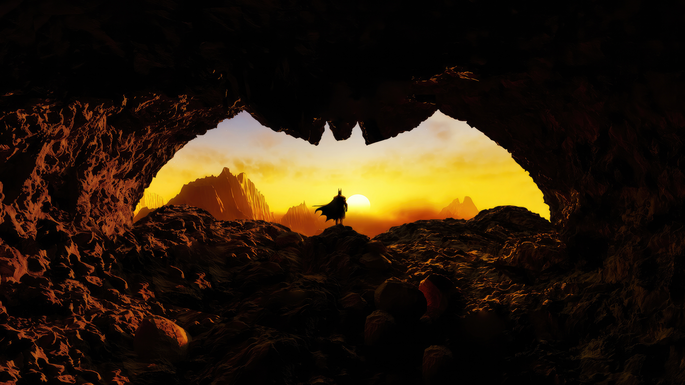 | 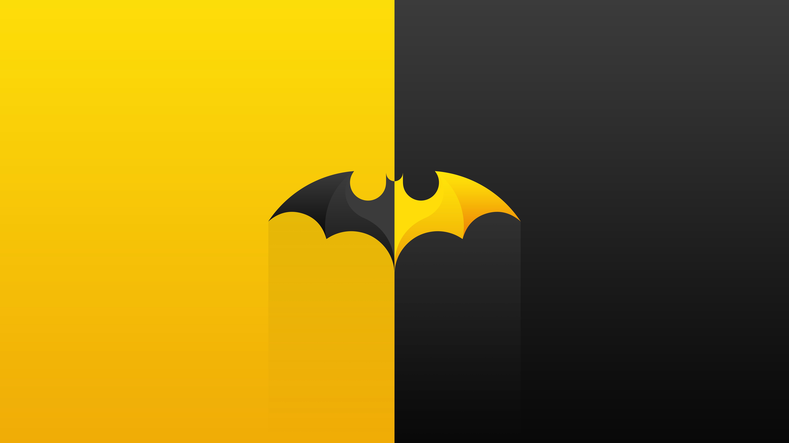 |
| 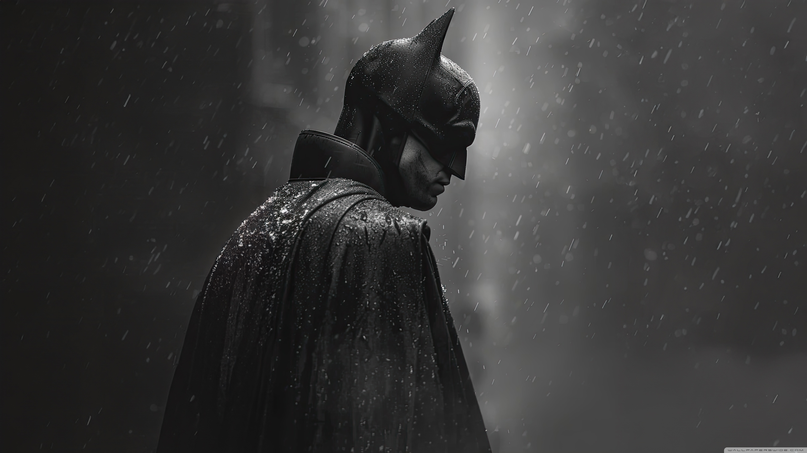 | 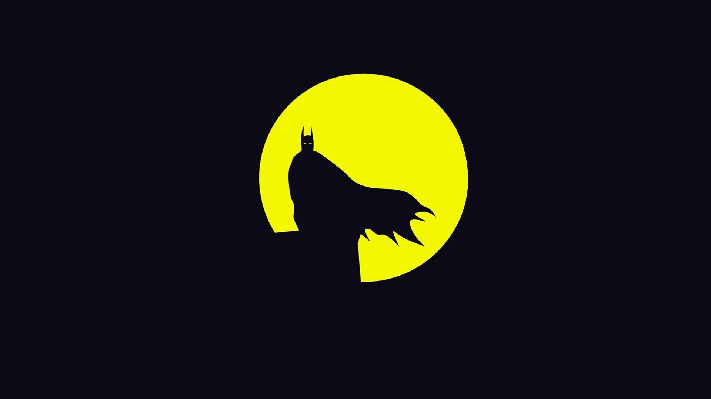 | 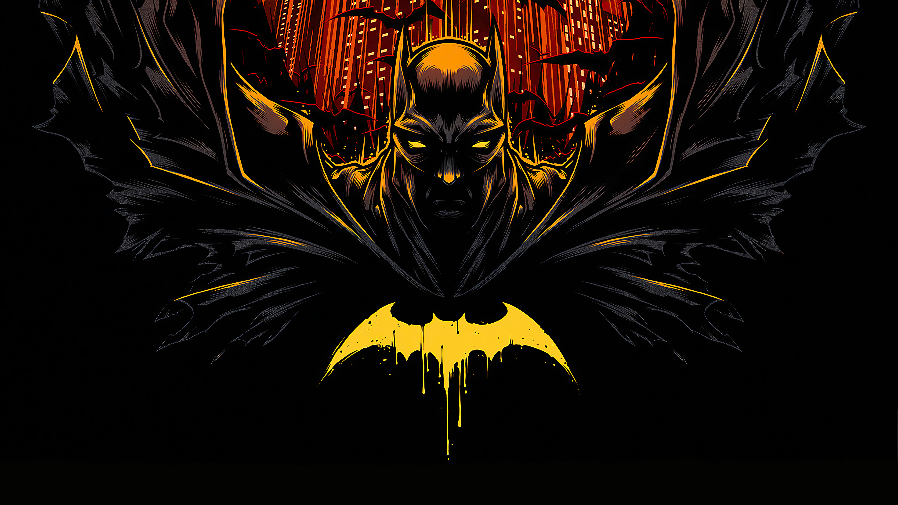 |
| 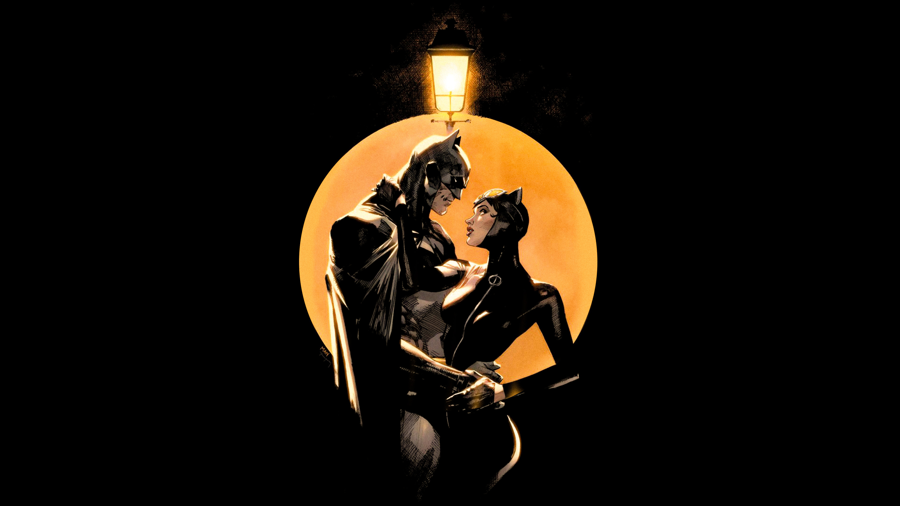 | 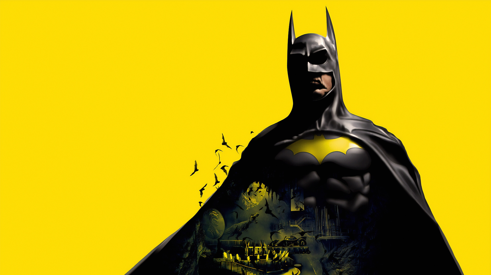 |  |

## Notes
- Waybar styling is derived from HANCORE-Linux's Waybar themes collection and adjusted to match the Batman palette.
